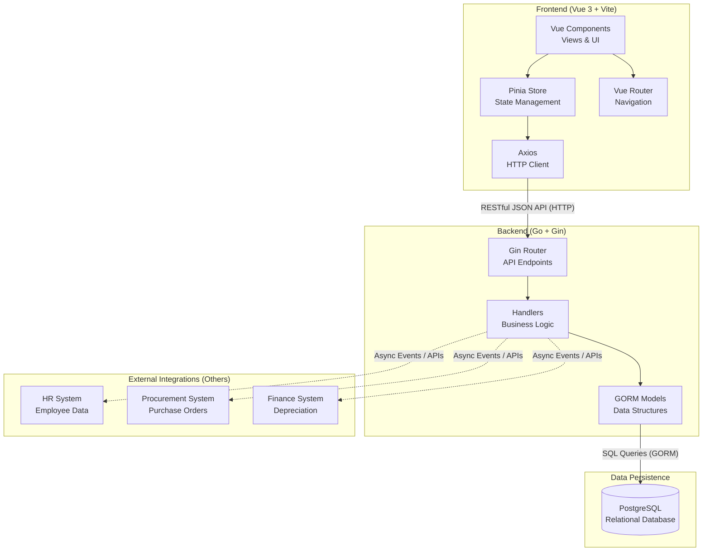

# ERP Asset Management System - Architecture & Onboarding Report

Welcome to the team! This document is designed to get you up to speed on the **ERP Asset Management System**. We'll cover how the system is built, how the different pieces connect to each other, and how we plan to integrate with other external systems.

## 1. High-Level System Architecture

At its core, this project follows a modern, decoupled **Client-Server Architecture**. The frontend handles all user interactions and interface rendering, while the backend manages business logic, data validation, and database storage.

Here is a visual map of how the components connect:



---

## 2. The Frontend (What the User Sees)

The frontend is located in the `/frontend` directory and is built to be fast, modern, and reactive. 

**Core Technologies & Why We Chose Them:**
* **Vue 3:** A progressive JavaScript framework. We use the Composition API (`<script setup>`) because it makes organizing component logic incredibly clean and reusable.
* **Vite:** Our build tool and development server. We use it instead of older tools like Webpack because it provides lightning-fast server starts and instant hot-module replacement (HMR).
* **Pinia:** The official state management library for Vue. It acts as our "single source of truth" for data (like the list of assets or the user's authentication token) so we don't have to pass data clumsily between nested components.
* **Axios:** A promise-based HTTP client used to send requests (GET, POST, PUT, DELETE) to our backend API.

---

## 3. The Backend (The Brains of the Operation)

The backend is located in the `/backend` directory and acts as the secure middleman between the user and the database.

**Core Technologies & Why We Chose Them:**
* **Go (Golang):** A compiled language developed by Google. We chose Go for the backend because it is incredibly fast, consumes very little memory, and has excellent built-in support for concurrent processing (useful for heavy tasks like calculating depreciation for thousands of assets simultaneously).
* **Gin Framework:** A web framework for Go. It's used to define our API routes (e.g., `/api/v1/assets`) and is known for being lightweight and extremely fast.
* **GORM:** An Object-Relational Mapper (ORM) for Go. Instead of writing raw SQL queries, GORM allows us to interact with the database using Go structs (models). It also automatically handles database migrations (creating tables if they don't exist).

---

## 4. The Database Connection

We use **PostgreSQL** as our primary database.

* **Why PostgreSQL?** Asset management involves highly relational data. An asset belongs to a category, is assigned to an employee, and has a history of maintenance logs. Relational databases excel at maintaining data integrity through foreign keys and constraints, ensuring we never have an assignment for an asset that doesn't exist.
* **How it connects:** The backend connects to Postgres on startup by reading credentials from a `.env` file (Host, Port, User, Password). GORM establishes the connection pool and manages the SQL transactions securely.

---

## 5. Connections to "Others" (External Systems)

An ERP (Enterprise Resource Planning) system is rarely an island. It needs to communicate with other departments. Here is how and why we connect with other systems:

> [!IMPORTANT]
> **Integration Strategy**
> We plan to use an **Event-Driven Integration Architecture** for connecting with external modules. This means instead of tightly coupling our code to theirs, we will publish and subscribe to events (e.g., using RabbitMQ, Kafka, or Webhooks) or use secure API polling.

### **HR System (Human Resources)**
* **Why connect?** Assets are checked out to employees. We need to know who the employees are, their IDs, and their departments.
* **The Connection:** We will fetch employee records from the HR system's API. When an employee leaves the company, the HR system can trigger an event notifying our Asset Management system to flag all their assigned assets for return.

### **Procurement System**
* **Why connect?** When a new laptop is purchased, it originates as a Purchase Order (PO) in Procurement. 
* **The Connection:** Notice the `Purchase Order ID` field in our "Add Asset" form. By linking our assets to the Procurement system's POs, we can automatically pull in purchase dates, vendors, and initial costs without manual data entry.

### **Finance System**
* **Why connect?** Physical assets lose value over time (depreciation). Finance needs these numbers for tax and accounting purposes.
* **The Connection:** Our backend will utilize Go's concurrent processing capabilities (Goroutines) to quickly calculate the current value of all assets (Straight-line or Double-declining methods) and expose this data via a secure API endpoint that the Finance system can ingest at the end of every quarter.

---

## 6. Quick Start Guide for Interns

To run the full stack locally:

1. **Database:** Ensure you have PostgreSQL running locally and your `.env` file in the `/backend` folder is configured with the correct `DB_USER` and `DB_PASSWORD`.
2. **Backend:** 
   ```bash
   cd backend
   go run main.go
   ```
   *(This starts the API on `http://localhost:8080`)*
3. **Frontend:**
   ```bash
   cd frontend
   npm install
   npm run dev
   ```
   *(This starts the UI on `http://localhost:5174`)*

Welcome aboard! Review the code in the `handlers` and `views` folders to see how these concepts are applied in practice.
